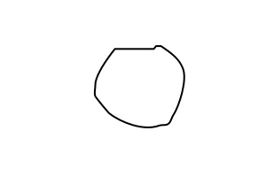
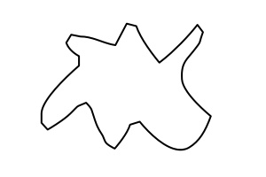

## Introduzione

Per dare un senso a quello che dicevo, ho creato un *framework* per testare la bontà dei diversi indici di presenza di habitat di salamandre che si possono calcolare rimescolando le variae misure da prendere in campo (perimetro, diametro, numero delle concavità ecc.). Il *framework* è un semplice *script* R, lo stesso che ha prodotto questo breve *report*.

Per testare lo script ho disegnato il profilo di tre ceppaie afferenti a tre tipologie diverse per potenziale presenza di habitat (nessuno [`Cerchio`], qualche [`Carpino`], molti [`Carpinoso`] habitat):






---

## Cosa fa lo script

Il framework calcola tutti gli indici per ciascuna tipologia, simula un conteggio delle salamandre che si potrebbero potenzialmente rilevare in ciascuna delle 3 tipologie di ceppaie e calcola la correlazione tra ciascuno degli indici e il conteggio di salamandre per ogni tipologia di ceppaia. Una migliore correlazione indica un indice più performante.

Per ora, gli indici considerati in questo test sono solo la dimensione frattale e l'indice proposto da Romano.


---

### Misure

Su ciascuno, con `ImageJ`, ho misurato la dimensione frattale (`Df`), perimetro (`B`), diametro massimo (`maxD`) ed ho imposto che il diametro a 1.30m sia 100 (`dbh`), ossia il diametro della ceppaia a cerchio:


```
##       Forma    Df      B  maxD dbh
## 1 Carpinoso 1.279 2059.0 228.8 100
## 2   Carpino 1.185  761.8 206.8 100
## 3   Cerchio 1.111  330.7 100.0 100
```


---

### Simulazione

La simulazione simula di trovare le salamandre in ciascuna tipologia di ceppaia. Il numero di salamandre viene estratto da una distribuzione normale di media e deviazione standard prefissati, per ogni tipologia di ceppaia:


```
##       Forma sAvg sStd
## 1 Carpinoso    3  1.0
## 2   Carpino    2  1.0
## 3   Cerchio    0  0.5
```


Per esempio, il numero di salamandre trovate nella simulazione della ceppaia `Carpinoso` viene estratta da una $\mathcal{N}($ 3 $,$ 1 $)$ troncata a 0. Su 10 alberi carpinosi, potremmo trovare: 2, 2, 3, 4, 4, 4, 3, 4, 3, 4 salamandre.

Per la ceppaia `Carpino`, invece, potremmo avere un numero di salamandre da una $\mathcal{N}($ 2 $,$ 1 $)$, per esempio: 2, 3, 1, 2, 2, 2, 3, 1, 1, 2

**I parametri delle distribuzioni sono da definire secondo l'esperienza di Antonio.**

---

## Valori dell'indice di A.Romano

I valori dell'indice di A. Romano per le tre ceppaie, secondo l'equazione $\left(\frac{B}{C}/\frac{C}{T}\right)-1$ e la dimensione frattale sono:


```r
sIndexRaw <- within(sIndexRaw, {
    C <- maxD * pi
    T <- dbh * pi
    RIndex <- ((B/C)/(C/T)) - 1
})
print(sIndexRaw[, c("Forma", "B", "C", "T", "RIndex", "Df")])
```

```
##       Forma      B     C     T   RIndex    Df
## 1 Carpinoso 2059.0 718.8 314.2  0.25197 1.279
## 2   Carpino  761.8 649.7 314.2 -0.43299 1.185
## 3   Cerchio  330.7 314.2 314.2  0.05265 1.111
```


Sembra strano il valore negativo per l'indice di Romano per il `Carpino`, se c'è un errore nel calcolo non riesco a trovarlo  (`Df` è la dimensione frattale, `RIndex` è l'indice di A.Romano).

---

## Simulazione


Eseguo 10000 simulazioni, su 3 tipologie di ceppaie, ottengo 30000 dati di conteggi di salamandre (come se avessi campionato 10000 boschi di 3 alberi ciascuno). 

Per ogni simulazione (o bosco) ho a disposizione i 2 indici, per ciascuno dei quali calcolo la correlazione lineare (pearson) con il numero di salamandre.


La media e la deviazione standard sulle 10000 simulazioni della correlazione tra indice e numero salamandre, per ciascun indice sono le seguenti:

```
##       ind correlationAvg correlationStd
## 1:     Df        0.85484         0.2053
## 2: RIndex        0.07014         0.4331
```


L'indice con `correlationAvg` maggiore è il migliore.

---

## Risultati

 


Grafico a violino della distribuzione delle 10000 correlazioni tra ciascun indice di presenza di habitat ed il numero simulato di salamandre nelle varie tipologie di ceppaie. L'ampiezza del "violino" è proporzionale al numero di punti corrispondenti alla correlazione (sulle ordinate). Tanto più ampio è il violino verso valori di correlazione pari ad 1, tanto migliore è l'indice per descrivere il numero di salamandre nella ceppaia.

---

## Conclusioni

Il framework per il calcolo è pronto. Occorre:

1. disegnare delle tipologie di ceppaie (più) realistiche
2. creare una famiglia di indici papabili (cfr. proposta di Mario)
3. misurare le varie lunghezze necessarie sui disegni
4. stimare i parametri della distribuzione probabile del numero di salamandre in ogni tipologia di ceppaia
5. eseguire lo script
6. selezionare gli indici più performanti
7. giudicare la loro speditività nella pratica


